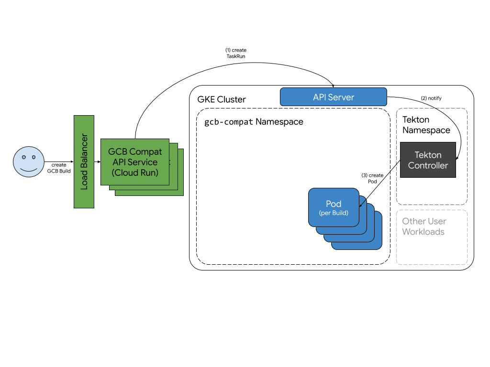

# Installing on Cloud Run

This doc describes installing the GCB Compatibility Service on [Cloud
Run](https://cloud.google.com/run). This might be preferrable if you don't have
much experience with Kubernetes or GKE, and if you want simpler deployment and
management of the service, including autoscaling and Google-managed SSL
certificates.

When installed this way, the service runs in Cloud Run outside your cluster and
connects to the cluster to run workloads.



The other alternative is to run the Service on your GKE cluster itself, which
gives you more control over the security and accessibility of the Service, but
requires more care to securely set it up. Installation instructions for GKE are
[here](install_cluster.md).

## Installation

In order to run off-cluster, the builder service account (`gcb-compat@`) has to
have permission to view clusters in the project:

```
gcloud projects add-iam-policy-binding ${PROJECT_ID} \
  --member serviceAccount:gcb-compat@${PROJECT_ID}.iam.gserviceaccount.com \
  --role roles/container.clusterViewer
```

The builder service account also has to have permissions to create and manage
Tekton resources on the cluster:

```
kubectl create rolebinding off-cluster-binding \
  --role=gcb-compat-role \
  --user=gcb-compat@${PROJECT_ID}.iam.gserviceaccount.com -n gcb-compat
```

Now, create the Cloud Run service, pointing at the cluster on which you want it
to run builds:

```
PROJECT_ID=$(gcloud config get-value project)
CLUSTER_ZONE=us-east4-a
CLUSTER_NAME=my-cluster-name
IMAGE=gcr.io/${PROJECT_ID}/github.com/ImJasonH/compat

gcloud beta run deploy gcb-compat \
  --platform=managed \
  --allow-unauthenticated \
  --service-account=gcb-compat@${PROJECT_ID}.iam.gserviceaccount.com \
  --image=${IMAGE} \
  --set-env-vars=CLUSTER_NAME=projects/${PROJECT_ID}/locations/${CLUSTER_ZONE}/clusters/${CLUSTER_NAME}
```

NB: Cloud Run services can only run in a handful of regions, so the region in
which the compat service runs might be different from the region where the
target cluster's. If possible, try to run them in the same region to reduce the
likelihood and impact of outages.

## Testing

When deploying succeeds, `gcloud` will print the URL where the new service is
running:

```
Service [gcb-compat] revision [gcb-compat-12345] has been deployed and is serving traffic at https://gcb-compat-blahblahblah.a.run.app
```

Next, tell `gcloud` to use that service instead of the regular GCB API service:

```
gcloud config set api_endpoint_overrides/cloudbuild https://gcb-compat-blahblahblah.a.run.app/
```

Now that we've pointed `gcloud` at the Service you deployed, we'll tell
`gcloud` to run a simple build:

```
cat > cloudbuild.yaml << EOF
steps:
- name: ubuntu
  args: ['echo', 'hello']
EOF
gcloud builds submit --no-source
```

The build has started! You should see logs streamed to your console, until the
build completes:

```
Created [https://gcb-compat-blahblahblah.a.run.appp/v1/projects/my-project/builds/79deb463-6a02-4f65-aae5-c572095d7835].
Logs are available in the Cloud Console.
----------------------------------- REMOTE BUILD OUTPUT ----------------------------------
hello
------------------------------------------------------------------------------------------
ID                                    CREATE_TIME                DURATION  SOURCE  IMAGES  STATUS
79deb463-6a02-4f65-aae5-c572095d7835  2019-08-14T16:52:08+00:00  6S        -       -       SUCCESS
```

Let's get the build details:

```
$ gcloud builds describe 79deb463-6a02-4f65-aae5-c572095d7835
createTime: '2019-08-14T16:52:08Z'
finishTime: '2019-08-14T16:52:14Z'
id: 79deb463-6a02-4f65-aae5-c572095d7835
logsBucket: gs://my-project_cloudbuild
results: {}
startTime: '2019-08-14T16:52:08Z'
status: SUCCESS
steps:
- args:
  - echo
  - hello
  name: ubuntu
  status: SUCCESS
  timing:
    endTime: '2019-08-14T16:52:13Z'
    startTime: '2019-08-14T16:52:11Z'
```

🎉🎉🎉

## Cleaning up

To tear down just the Service running on the cluster:

```
gcloud beta run services delete gcb-compat --platform=managed
```

To delete the IAM Service Account:

```
gcloud iam service-accounts delete gcb-compat@${PROJECT_ID}.iam.gserviceaccount.com
```

And to point `gcloud` at the standard hosted GCB API:

```
gcloud config unset api_endpoint_overrides/cloudbuild
```
